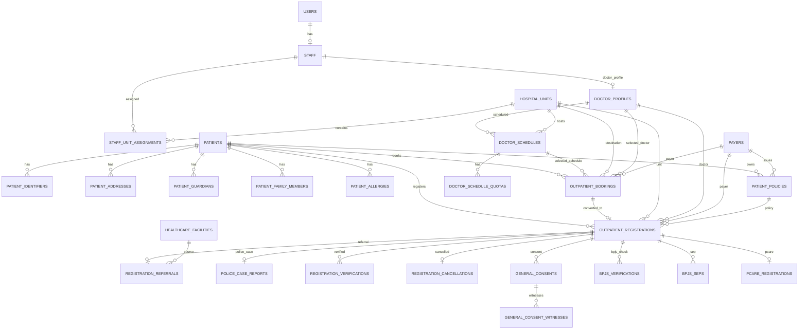
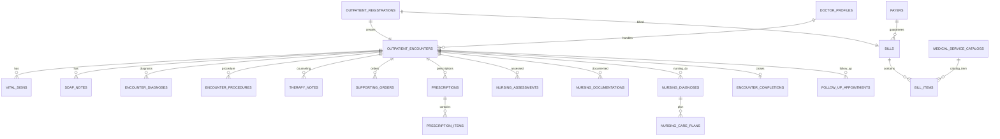

# ERD SIMRS – Berdasarkan UI/UX Figma

Skema ini disusun dari alur yang terlihat pada UI/UX: autentikasi pegawai, master poli/dokter/penjamin, pasien baru, booking, pendaftaran rawat jalan, rujukan, kasus polisi, BPJS/SEP/PCare, General Consent, pemeriksaan rawat jalan, SOAP, ICD-10, ICD-9, order penunjang, ASKEP, billing, pembatalan, dan kontrol ulang.

## 1. ERD Inti – Admisi dan Pendaftaran



## 2. ERD Klinis – Pemeriksaan Rawat Jalan



## 3. Mapping UI ke Tabel

| Modul UI/UX | Tabel utama |
|---|---|
| Login / Register pegawai | `users`, `staff`, `doctor_profiles`, `staff_unit_assignments` |
| Master poli/unit | `hospital_units` |
| Master dokter | `staff`, `doctor_profiles` |
| Jadwal & kuota dokter | `doctor_schedules`, `doctor_schedule_quotas` |
| Pasien baru | `patients`, `patient_identifiers`, `patient_addresses`, `patient_guardians`, `patient_family_members` |
| Alergi pasien | `patient_allergies` |
| Penjamin/polis | `payers`, `patient_policies` |
| List Booking | `outpatient_bookings` |
| Mobile JKN / Draft SEP | `outpatient_bookings`, `bpjs_seps` |
| Pendaftaran rawat jalan | `outpatient_registrations` |
| Rujukan | `registration_referrals`, `healthcare_facilities` |
| Kasus polisi | `police_case_reports` |
| Verifikasi pasien | `registration_verifications` |
| Pembatalan + otorisasi | `registration_cancellations`, `audit_logs` |
| General Consent | `general_consents`, `general_consent_witnesses` |
| BPJS VClaim | `bpjs_verifications`, `bpjs_seps` |
| BPJS PCare | `pcare_registrations` |
| Pemeriksaan rawat jalan | `outpatient_encounters` |
| Tanda vital | `vital_signs` |
| SOAP | `soap_notes` |
| Diagnosa ICD-10 | `encounter_diagnoses` |
| Prosedur ICD-9 | `encounter_procedures` |
| Konseling/terapi | `therapy_notes` |
| Order penunjang | `supporting_orders` |
| Resep / obat aktif | `prescriptions`, `prescription_items` |
| ASKEP anamnesis | `nursing_assessments` |
| SOAPIER / ADIME / SBAR | `nursing_documentations` |
| Diagnosa keperawatan | `nursing_diagnoses` |
| SDKI / SLKI / SIKI | `nursing_care_plans` |
| Billing | `bills`, `bill_items`, `medical_service_catalogs` |
| Selesai pelayanan | `encounter_completions` |
| Kontrol ulang | `follow_up_appointments` |
| Audit aktivitas penting | `audit_logs` |

## 4. Alur Data Utama

```text
Patient
  -> Booking (opsional)
  -> Outpatient Registration
      -> Referral / Police Case / Verification / Consent / BPJS
      -> Outpatient Encounter
          -> Vital Signs
          -> SOAP
          -> ICD-10 Diagnosis
          -> ICD-9 Procedure
          -> Supporting Orders
          -> Prescription
          -> Nursing Documentation
          -> Billing
          -> Encounter Completion
              -> Follow-up Appointment (jika kontrol ulang)
```

## 5. Keputusan Desain Penting

1. `age` tidak disimpan; usia dihitung dari `birth_date` supaya tidak menjadi data basi.
2. Poli, dokter, penjamin, jadwal dan layanan menggunakan foreign key; tidak disimpan sebagai teks berulang.
3. Kuota dokter dinormalisasi per kanal (`ONLINE`/`ONSITE`) dan kelompok penjamin (`BPJS`/`NON_BPJS`).
4. Nomor SEP dibuat sebagai entitas transaksi tersendiri karena SEP terkait kunjungan, bukan identitas permanen pasien.
5. General Consent menyimpan snapshot data wali dan path tanda tangan agar isi dokumen pada saat ditandatangani tetap dapat direkonstruksi.
6. Otorisasi pembatalan tidak menyimpan password pengguna. Password hanya diverifikasi saat request; database menyimpan `authorized_by`, waktu otorisasi, dan alasan.
7. SOAP dan catatan klinis dapat memiliki lebih dari satu entry agar history tidak hilang ketika catatan diperbarui.
8. SOAPIER, ADIME, dan SBAR berada pada satu tabel `nursing_documentations` dengan `documentation_type` dan JSON `content`, karena ketiganya memiliki struktur field berbeda tetapi lifecycle yang sama.
9. Tarif pada `bill_items` tetap menyimpan snapshot `unit_price`; perubahan tarif master setelah transaksi tidak mengubah tagihan lama.
10. `audit_logs` disediakan untuk perubahan penting karena SIMRS memerlukan jejak siapa melakukan perubahan data.
